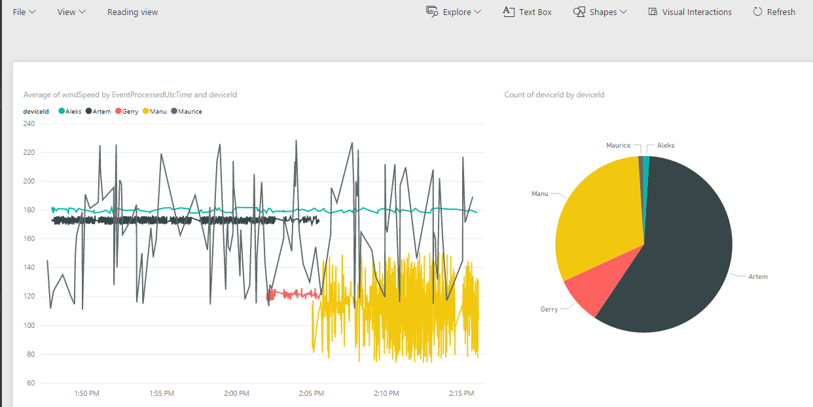
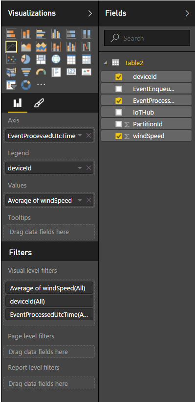
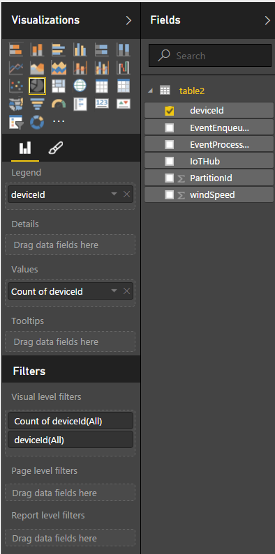

# Azure IOT Hub Demo 

This project contains a demo for Azure IOT Hub. The demo application is from Microsoft and has been modified by Trivadis.MME.
More information can be found here:
[/IoTDeviceExplorer/doc/how_to_use_device_explorer.md](./IoTDeviceExplorer/doc/how_to_use_device_explorer.md)

# Demo Setup

1. Create an IOT Hub in the Azure Portal
2. Copy connection information from portal
3. Start Device Explorer 
4. Add connection string and click update -> You are now connected to the IOT Hub

The application has the folowing features:

## Tab Management:

* Create, Update, Delete Device Registrations in the IOT Hub.
* Use Start Simulator to simulate a device sending data.

Create SAS:
* On the Tab "Configuration" you can create SASs.

## Tab Data:
* Select a device on the Management Tab and go to the data tab. 
* Monitor the data that is sent from a device.

## Tab Message to Device:
* When device simulators are running, you can send messages from the cloud to the devices (C2D).
-> The messages show up in the simulator console windows.

* Optionally, you can enable the Feedback Endpoint Monitoring which will send a message to confirm to the Hub that the C2D msg has been recieved by the device.

# Optional additional demo steps:
Create an instance of a Stream Analytics Job in the portal.
* Set the IOT Hub as Input
* Set PowerBI as Output
* Define a pass-through query
* Start

Register devices and start the simulator

Go to PowerBI
* There should be a new dataset with the name that you defined in the Stream Analytics Output
* Create a new dashboard on that dataset. 
* Add charts:

Line chart configuration:

Pie Chart configuration:

