# 1. Create a [Resource Group](https://azure.microsoft.com/en-us/documentation/articles/resource-group-overview/#resource-groups)

Login into the [Azure portal](https://portal.azure.com) to deploy and manage your Azure resources. 
First of all, we need a new Resource Group. A resource group is a container that holds related resources for an application. 
The resource group could include all of the resources for an application, or only those resources that are logically grouped together. You can decide how you want to allocate resources to resource groups based on what makes the most sense for your organization.

To create an empty resource group, select **New**, **Management**, and **Resource Group**.

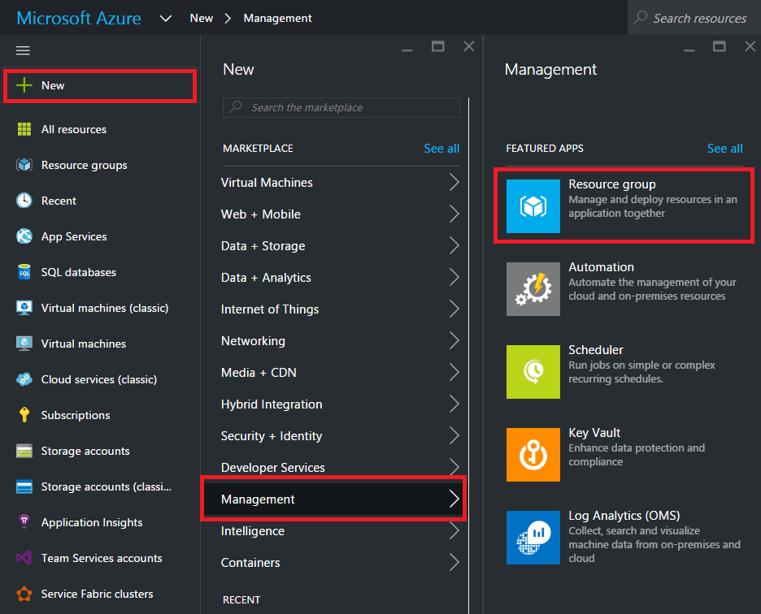

Give it a name and location (West Europe), select a subscription and press create.


# 2. Create an [App Service Plan](https://azure.microsoft.com/en-us/documentation/articles/azure-web-sites-web-hosting-plans-in-depth-overview/)

An App Service plan represents a set of features and capacity that you can share across multiple apps in Azure App Service, including Web Apps, Mobile Apps, Logic Apps or API Apps. These plans support 5 pricing tiers (Free, Shared, Basic, Standard and Premium) where each tier has its own capabilities and capacity. Apps in the same subscription and geographic location can share a plan. All the apps sharing a plan can leverage all the capabilities and features defined by the plan's tier. All apps associated with a given plan run on the resources defined by the plan. For example, if your plan is configured to use two "small" instances in the standard service tier, all apps associated with that plan will run on both instances and will have access to the standard service tier functionality. App Service plan instances on which apps are running on are fully managed and highly available.

To create a new App Service Plan, go to your resource group and click **Add**. Then search for **App Service Plan**, select the item and press create. This ensures that the App Service Plan is automatically added to your resource group.

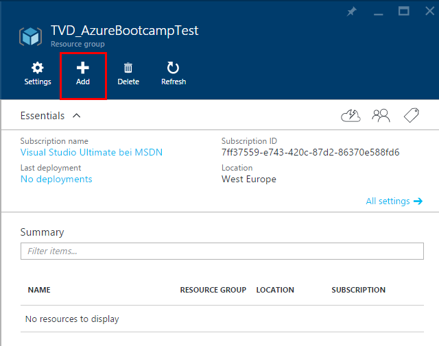


As an alternative, you could start with the **New** button in the portal navigation bar and set the resource group later. 

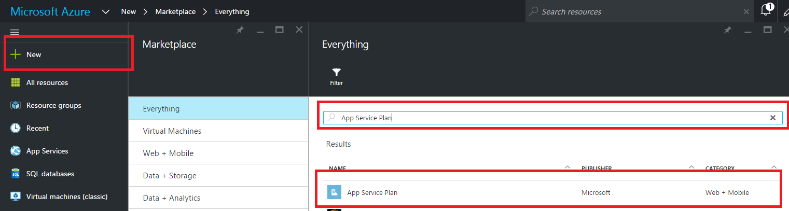

Give it a name, a subscription, select the Resource Group created before and a location (West Europe).
Finally, select a pricing tier and click create. For the Trivadis Azure Bootcamp App, the [F1 Free Pricing Tier](https://azure.microsoft.com/en-us/pricing/details/app-service/) fits perfectly.

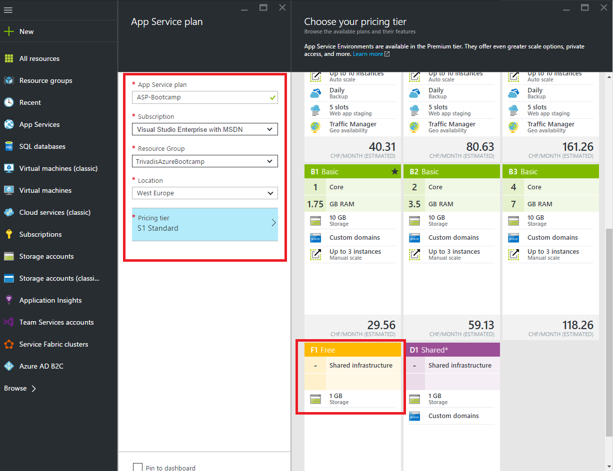

# 3. Create a [Web App](https://azure.microsoft.com/en-us/documentation/articles/app-service-web-overview/)

Azure App Service Web Apps is a fully managed platform that enables you to build, deploy and scale enterprise-grade web apps in seconds. Focus on your application code, 
and let Azure take care of the infrastructure to scale and securely run it for you.

For our frontend we need to create a new web app by selecting **New**, **Web + Mobile**, then **Web App** (Alternatively, select **Add** in your resource group).

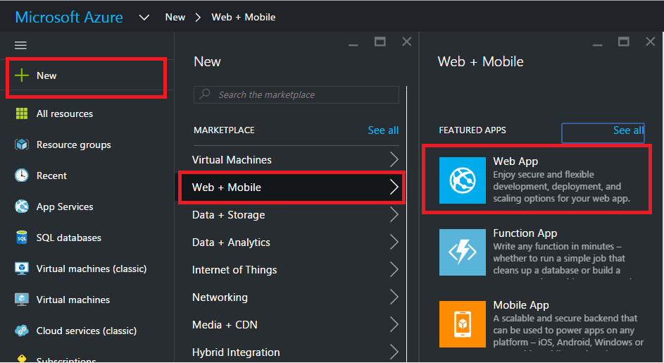

Give it a name, a subscription, select the Resource Group and the App Service plan created before and click create.

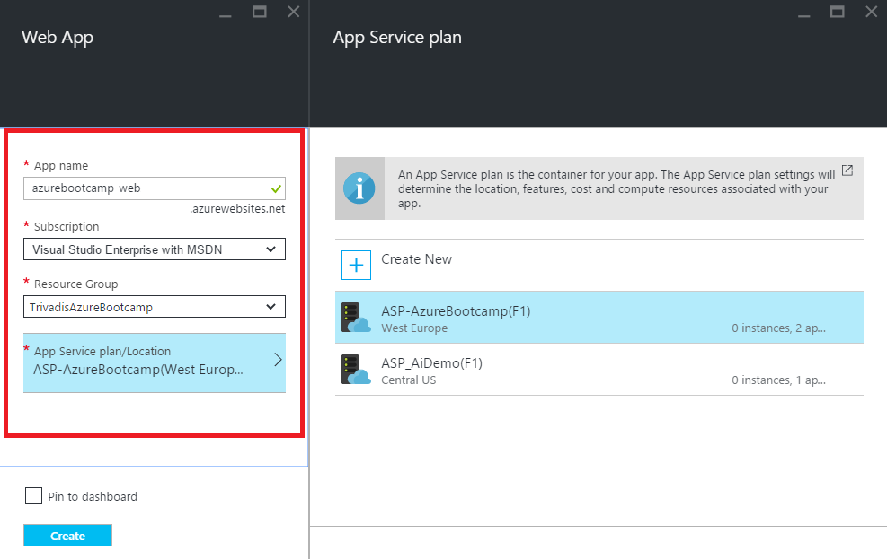

As soon the application is created, open your Web App in the portal and hit the **browse** button.

 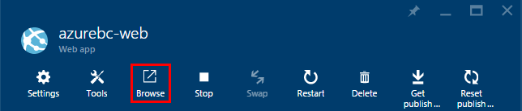

You should see the Azure screen that confirms the successful creation of your app.

Alternatively navigate your browser to:  **your app name**.azurewebsites.net.  Ex. ** http://azurebootcamp-web.azurewebsites.net/ **

Congratulations. Your Azure Web App is LIVE!


# 4. Create an [API App](https://azure.microsoft.com/en-us/documentation/articles/app-service-api-apps-why-best-platform/)

An Azure API App is an ASP.NET Web API App that is hosted in Azure and provides a REST-based interface. The interface is specified in a Swagger (http://swagger.io/) document. Swagger is a standardized language used to describe REST APIs (think WSDL for REST).  An API app can take advantage of features offered by Web Apps and Mobile Apps. The reverse is also true: if you use a web app or mobile app to host an API, it can take advantage of API Apps features such as Swagger metadata for client code generation and CORS for cross-domain browser access. The only difference between the three app types (API, web, mobile) is the **name and icon** used for them in the Azure portal.

For our backend we need to create a new api app by selecting **New**, **Web + Mobile**, then **API App**.

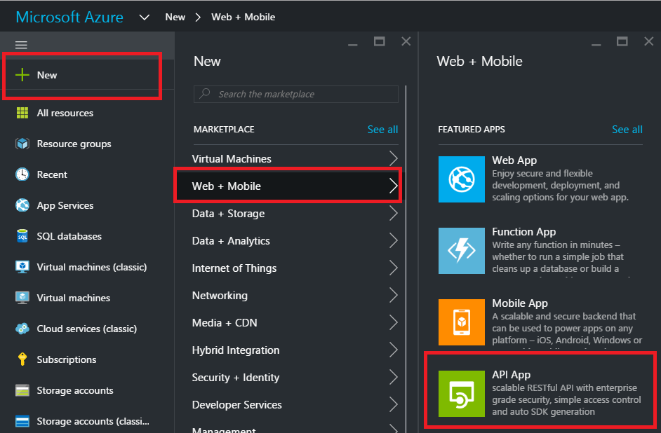

Give it a name, a subscription, select the Resource Group and the App Service plan created before and press create.

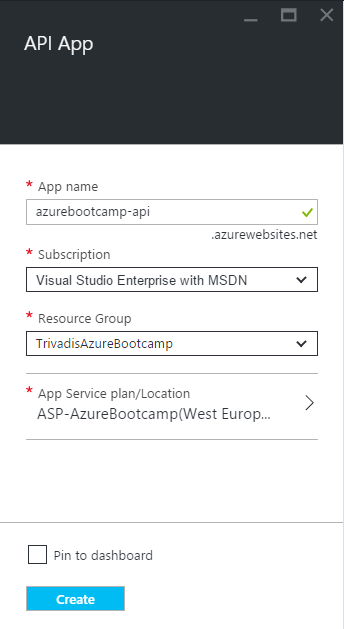

# 5. Get the Trivadis Azure Bootcamp sample application

The Azure Bootcamp sample Application consists of an API- and Web-Application. The frontend is built using [AngularJS](https://angularjs.org/), [Angular Material](https://material.angularjs.org)
and [SignalR](http://signalr.net/) with [TypeScript](https://www.typescriptlang.org/), while the backend is just a simple [ASP.NET Web API](http://www.asp.net/web-api).

The sample application uses the following Azure Services:

1. [Storage](https://azure.microsoft.com/en-us/services/storage/)
2. [Web Apps](https://azure.microsoft.com/en-us/services/app-service/web/)
3. [API Apps](https://azure.microsoft.com/en-us/services/app-service/api/)
4. [Azure Active Directory B2C](https://azure.microsoft.com/en-us/services/active-directory-b2c/)


The code for the Azure Bootcamp App [is maintained on GitHub](https://github.com/Trivadis/AzureDeveloperBootcamp). 
You can clone the application by executing the following command:

```
git clone --branch lab https://github.com/Trivadis/AzureDeveloperBootcamp
```

Open **Trivadis.AzureBootcamp.sln** solution in Visual Studio, go to [Package Manager Console](https://docs.nuget.org/consume/package-manager-console)
by selecting **View** -> **Other Windows** -> **Package Manager Console** and execute a [NuGet Package Restore](https://docs.nuget.org/consume/package-restore)
by clicking the **Restore**-Button

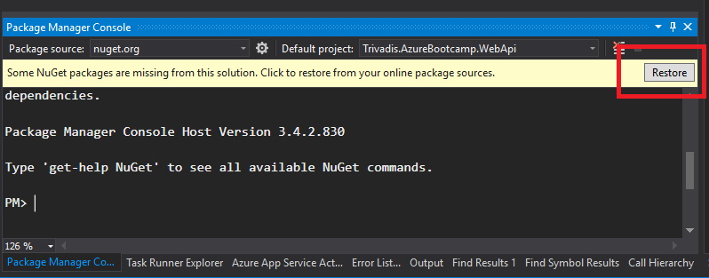

# 5.1 Run Azure Bootcamp in Visual Studio

 The Trivadis Azure Bootcamp App also runs locally in Visual Studio. To start the app in your local environment, be sure both
 **Trivadis.AzureBootcamp.WebApi** and **Trivadis.AzureBootcamp.WebApp** are selected as startup. Right-Click the **Trivadis.AzureBootcamp Solution**-Node and select **Set StartUp Projects...**
 
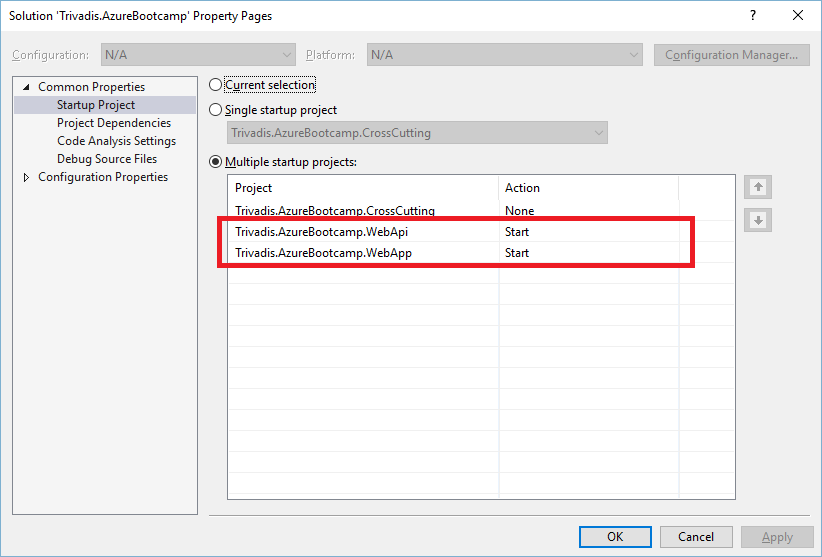

Now press F5. 

Note : The first time you start the application, 
Visual Studio asks you to install a self-signed SSL Certifcate to use https. 
You must accept both messages, otherwise the application won't work properly.

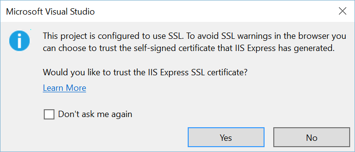
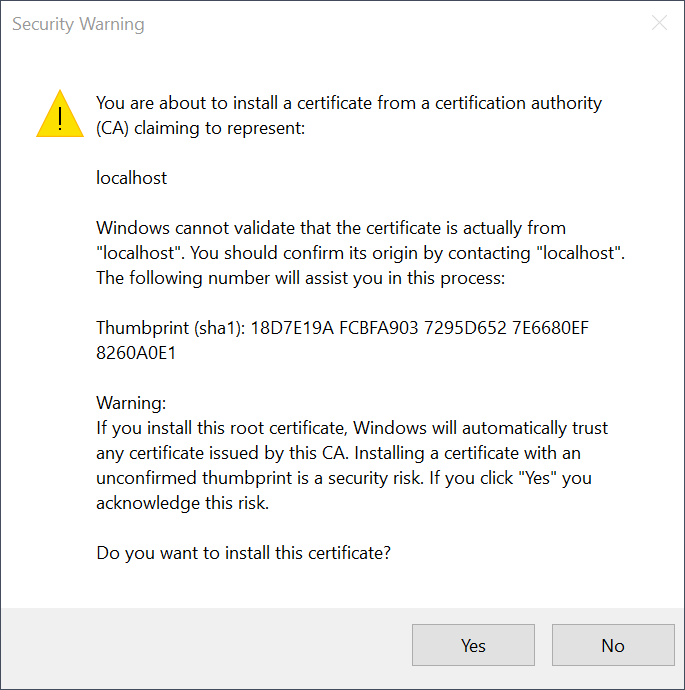


The applications should start in two browser Windows. Go to the login screen, press **Login**, enter a name and hit **Login**. You should end up in the chat room.

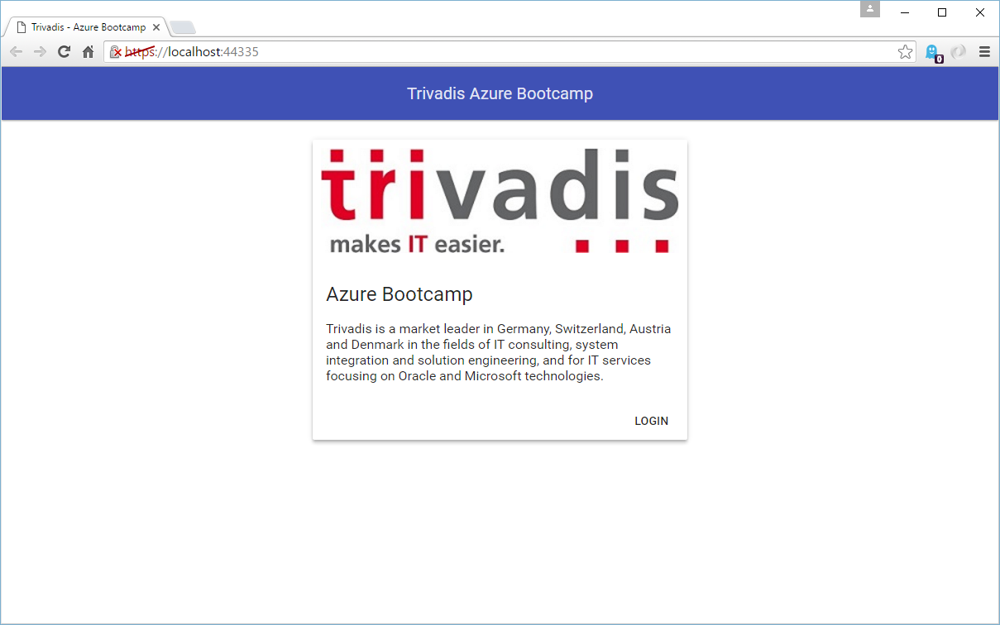

In order to verify that the API App is running correctly, go to the other browser window and navigate to: https://localhost:44324/api/admin/users. You should receive a json response that contains your user details.

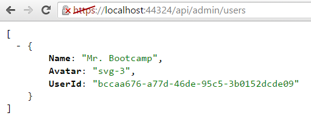

Now that the apps are running, lets deploy to the cloud!


# 6. Publish Azure Bootcamp API App

First of all, we need to publish our backend **(Trivadis.AzureBootcamp.WebApi)** to azure. 
The backend is responsible for the communication between the clients **(Trivadis.AzureBootcamp.WebApp)**.
To publish the project to an API App, simply right-click the **Trivadis.AzureBootcamp.WebApi** project then select **Publish**.

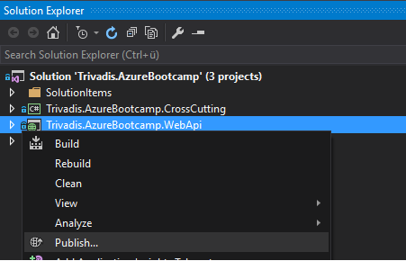

Select Microsoft Azure App Service and click Next.

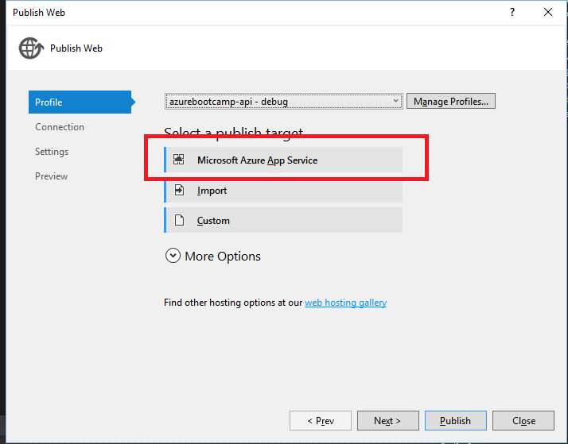

Select your App API created before.

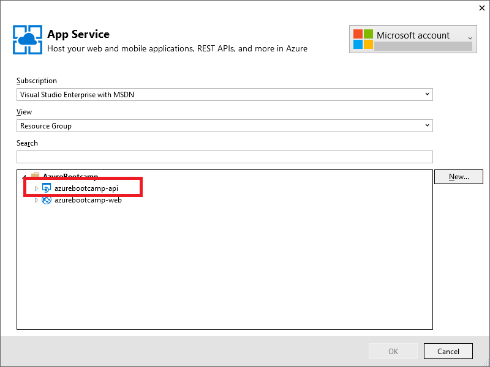

Click Ok and Next.

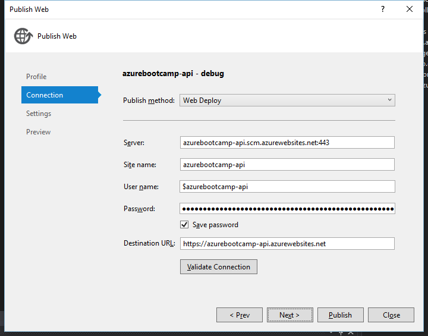

Select the **CloudDebug** Configuration. Finally publish your API App by clicking the **Publish** button.

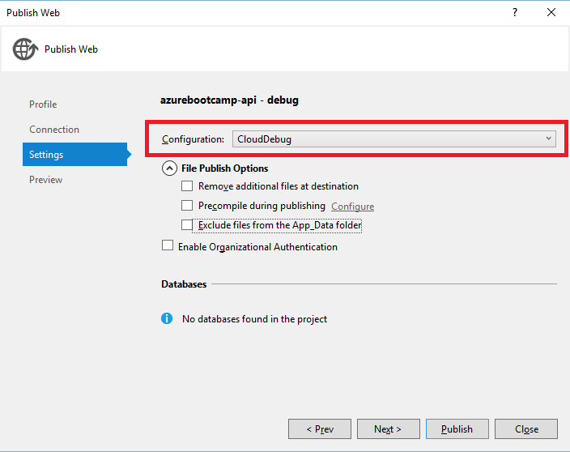

When publishing has finished successfully, open a browser and type the URL of your API into addressbar to ensure your endpoint is up and running. Navigate to http://myname.azurewebsites.net/api/admin/users. You should get an empty JSON array as a response.

## 6.1 Publish Azure Bootcamp Web App

Before we can publish the Web App, we must configure our API Endpoint.
In Visual Studio open the file **Web.CloudDebug.config** within the **Trivadis.AzureBootcamp.WebApp** project and 
set the value of the **ApiHost** and **ApiRoot** property.

```
  <appSettings>
    <add key="ApiHost" value="https://YOUR-API-APPSERVICE.azurewebsites.net"  xdt:Transform="Replace" xdt:Locator="Match(key)" />
    <add key="ApiRoot" value="https://YOUR-API-APPSERVICE.azurewebsites.net/api/"  xdt:Transform="Replace" xdt:Locator="Match(key)" />
  </appSettings>
```

Now its time to publish the frontend Web App. Repeat all steps described under chapter 6, but this time, 
select the **Trivadis.AzureBootcamp.WebApp** Project to publish. Be sure you are using the **CloudDebug** Configuration again.
 
In the App Service dialog, ensure you have selected the Web App - Service.

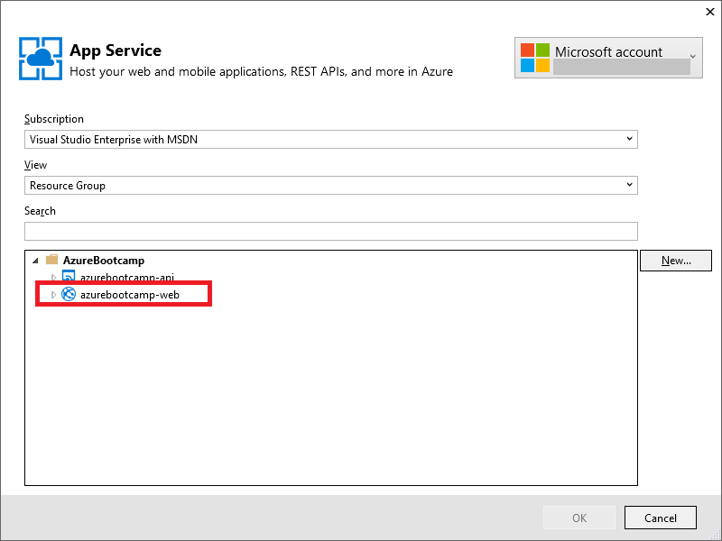

After publishing has succeeded, you shoulb be able to login into Trivadis Azure Bootcamp App, using your Web App's URL. Click on 'Login' and choose a name


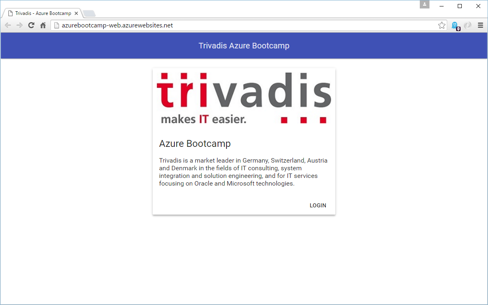

Congratulations, you have successfully completed Lab 1.
