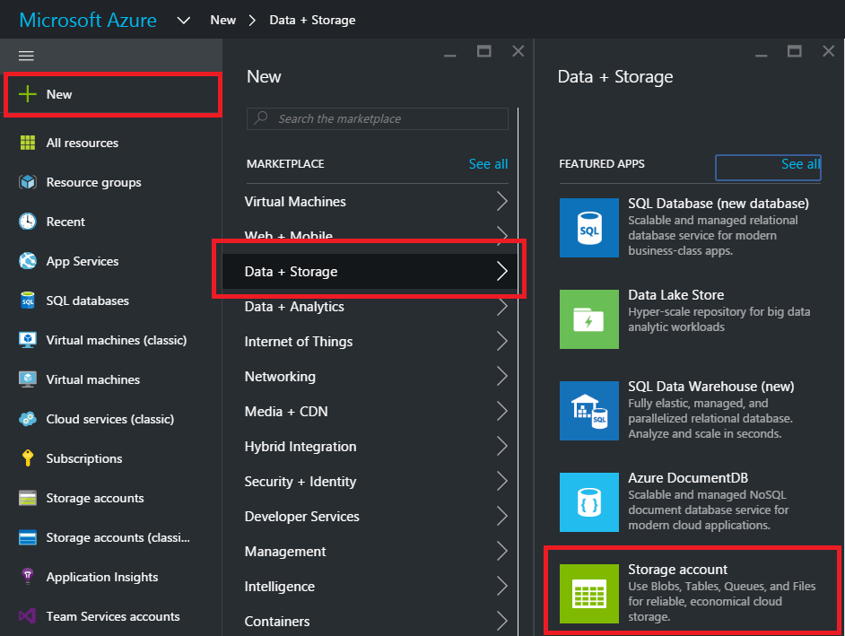
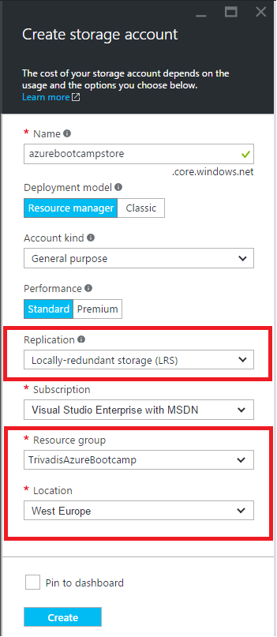
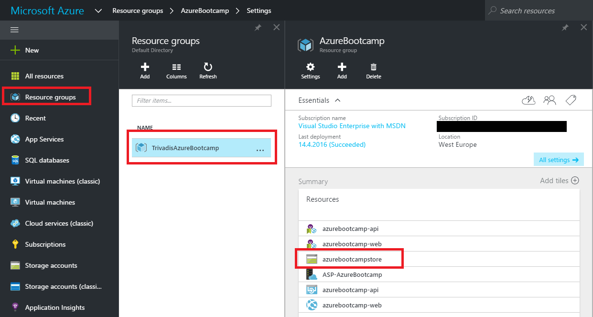
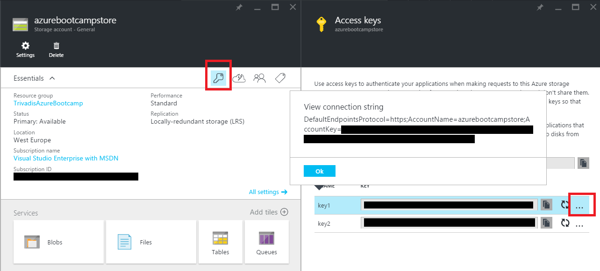
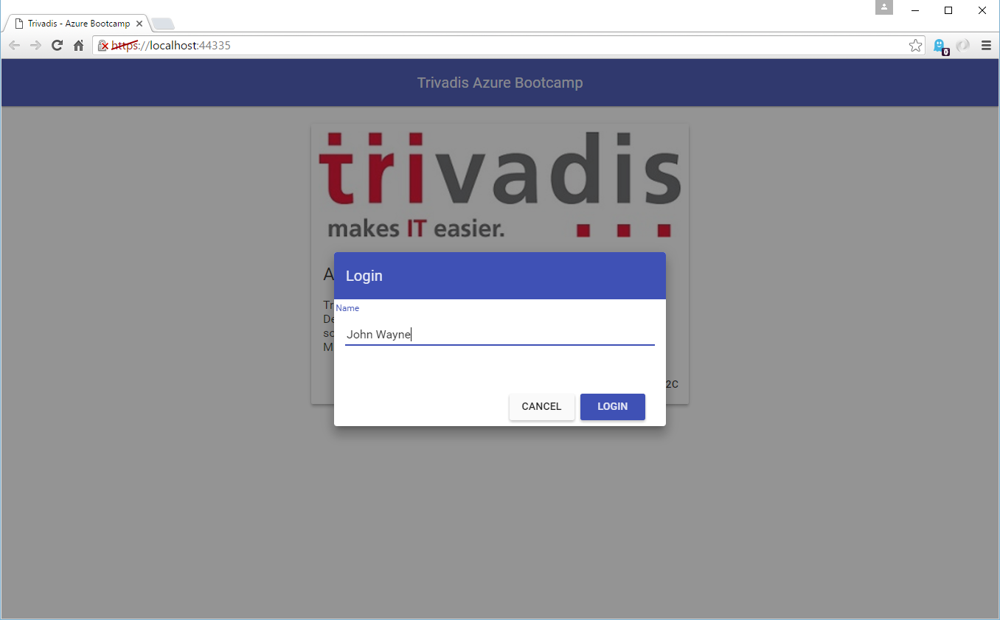
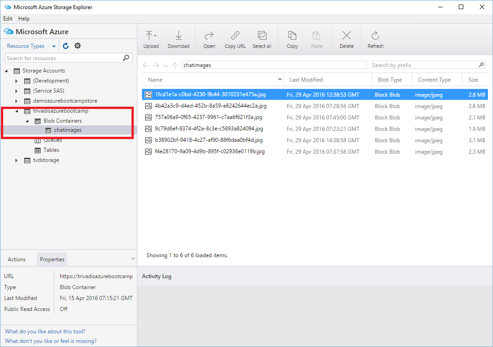
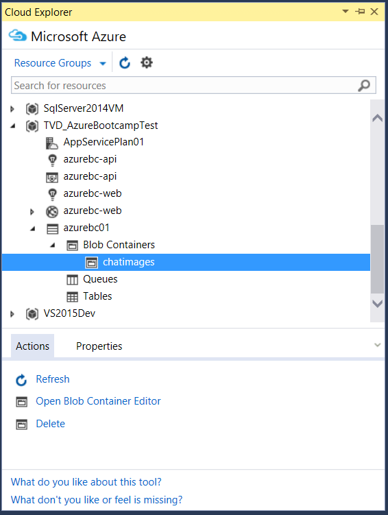

# 1. Create a [Azure Storage Account](https://azure.microsoft.com/en-us/documentation/articles/storage-introduction/)

An Azure storage account gives you access to the Azure Blob, Queue, Table, and File services in Azure Storage.
Your storage account provides the unique namespace for your Azure Storage data objects. 
By default, the data in your account is available only to you, the account owner.

Sign in into [Azure Portal](https://portal.azure.com/).

To create Storage Account, select **New**, **Data + Storage**, and **Storage account**.



Set a unique name for your storage. For [Deployment model](https://azure.microsoft.com/en-us/documentation/articles/resource-manager-deployment-model/), [Performance](https://azure.microsoft.com/en-us/documentation/articles/storage-introduction/#introducing-the-azure-storage-services) 
and [Replication](https://azure.microsoft.com/en-us/documentation/articles/storage-redundancy/) take the default values as shown in the screenshot.

Be sure you have selected your [Resource Group](https://azure.microsoft.com/en-us/documentation/articles/resource-group-overview/#resource-groups) and the Location is set to **West Europe**.
Finally, click 'Create' to create your new storage account.



As soon the Storage Account is created, you should be able to configure it through **Resource groups** -> **Your Resource group** -> **Click in the summary panel** 



The access keys are available through the Key-Icon and click on **...**
We need the connectionstring later in the demo. 




# 2. Integrate Storage Account

To store images sent by the application, we need to configure the Storage Account.
Take the copied connection string from above and insert into Web.config in the **Trivadis.AzureBootcamp.WebApi** Project.

```xml
  <appSettings>
    <add key="AzureStorageAccount" value="<YOUR CONNECTION STRING>" />
  </appSettings>
```

Add the code to upload an image file into blob storage to the class
**Trivadis.AzureBootcamp.CrossCutting.CloudStorage.AzureStorageAccount**
 
Use this snippet as a reference:

```csharp
public async Task<CloudStorageFileUploadResult> UploadAsync(CloudStorageFileUpload file)
{
    if (file == null)
        throw new ArgumentNullException(nameof(file));

    CloudBlockBlob cloudblob = CreateCloudBlockBlob(file);
    string uri = CreateSharedAccessBlobPolicy(cloudblob);

    await cloudblob.UploadFromFileAsync(file.FilePath);

    CloudStorageFileUploadResult result = new CloudStorageFileUploadResult();
    result.Uri = uri;
    result.ContentType = file.ContentType;
    result.Filename = file.RealFileName;

    return result;
}
```

Restart the application by pressing F5 and login into chat



Select an image, write a message and press send 


After the message is sent and the image appears in the chat application, open your storage account with a tool of your choice, 
for instance the [Microsoft Azure Storage Explorer](http://storageexplorer.com/) or the 
[Visual Studio Cloud Explorer](https://visualstudiogallery.msdn.microsoft.com/84e83a7c-9606-4f9f-83dd-0f6182f13add/)
(see below), and browse the blob container (chatimages). 






Note : All images (blobs) are stored using a [Shared Access Signature](https://azure.microsoft.com/en-us/documentation/articles/storage-dotnet-shared-access-signature-part-1/). The SAS ist created in the **CreateSharedAccessBlobPolicy**-Method in the **Trivadis.AzureBootcamp.CrossCutting.CloudStorage.AzureStorageAccount** class

A shared access signature provides delegated access to resources in your storage account. 
This means that you can grant a client limited permissions to objects in your storage account 
for a **specified period of time** and with a specified set of permissions, without having to share your account access keys. The SAS is a URI that encompasses in its query parameters all of the information necessary for authenticated access to a storage resource. 
To access storage resources with the SAS, the client only needs to pass in the SAS to the appropriate constructor or method.


