# 1. Create an [Azure Active Directory B2C](https://azure.microsoft.com/en-us/documentation/articles/active-directory-b2c-get-started/)

Azure Active Directory B2C is a comprehensive cloud identity management solution for your consumer-facing web and mobile applications. It is a highly available global service that scales to hundreds of millions of consumer identities. Built on an enterprise-grade secure platform, Azure Active Directory B2C keeps your applications, your business, and your consumers protected.


Navigate to your resource group and click **Add**. Search for **Active Directory** and click **Create**. The Active Directory resource need to be created in the  [Azure classic portal](https://manage.windowsazure.com/). The new portal will forward you to the old portal automatically.

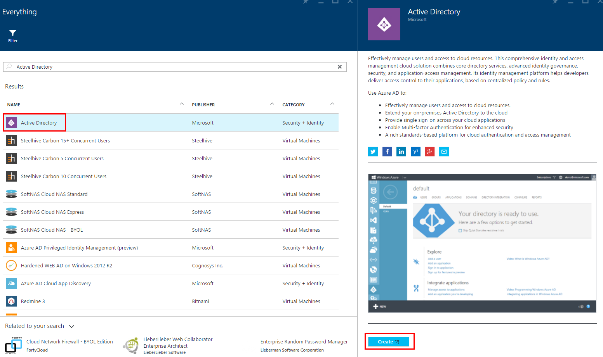

Choose the Name, Domain Name and Country or Region for your tenant.
Check the option that says **This is a B2C directory** and click the check mark to complete the action.


Navigate to the Active Directory extension on the navigation bar on the left side.
Find your tenant under the **Directory** tab and click it. Click the **Configure** tab.
Click the **Manage B2C settings** link in the **B2C administration** section.


The Azure portal with the B2C features blade showing will open in a new browser tab or window.

# 2. [Register your application](https://azure.microsoft.com/en-us/documentation/articles/active-directory-b2c-app-registration/#register-an-application)

On the B2C features blade on the Azure portal, click Applications.
Click **+Add** at the top of the blade. Enter a **Name** for the application that will describe your application to consumers. 
Toggle the Include web app / web API switch to Yes. 

The Reply URLs are endpoints where Azure AD B2C will return any tokens that your application requests. 
Set the reply URL to your local path.

```
https://localhost:44335/
```

If your application includes a server-side component (API) that needs to be secured, 
you'll want to create an Application Secret as well by clicking the **Generate Key** button. Copy the key for late use.

Click **Create**.

From the **Applications** list in the directory blade, navigate to the application that you just added. Copy the **Application Client ID** for later use.

From the main directory blade, copy the **Directory domain** for later use.

Note : The **Directory Domain**, **Application Client ID** and **App Key** are all needed later in the lab.

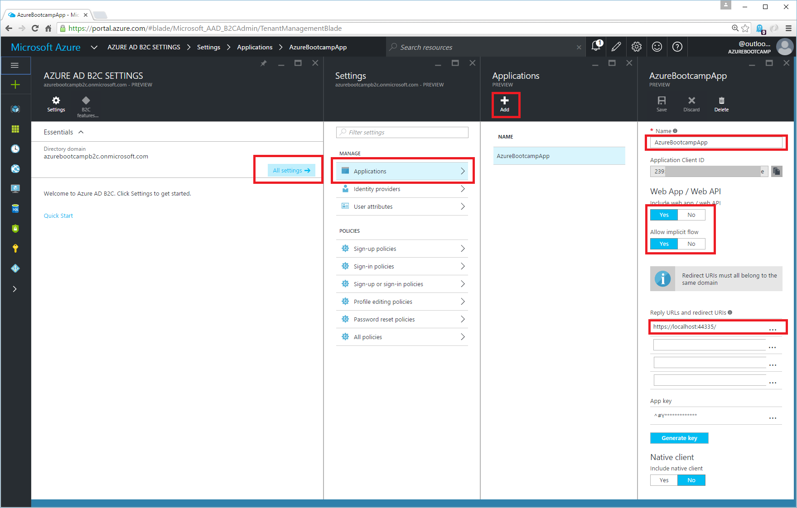

# 3. Create policies

The [extensible policy framework of Azure Active Directory (Azure AD) B2C](https://azure.microsoft.com/en-us/documentation/articles/active-directory-b2c-reference-policies/) is the core strength of the service. Policies fully describe consumer identity experiences such as sign-up, sign-in or profile editing. For instance, a sign-up policy allows you to control behaviors by configuring the following settings:

+ Account types (social accounts such as Facebook, or local accounts such as email address) that consumers can use to sign up for the application.
+ Attributes (for example, first name, postal code, and shoe size) to be collected from the consumer during sign-up.
+ Use of Multi-Factor Authentication.
+ The look-and-feel of all sign-up pages.
+ Information (which manifests as claims in a token) that the application receives when the policy run finishes.

You can create multiple policies of different types in your tenant and use them in your applications as needed. Policies can be reused across applications. This allows developers to define and modify consumer identity experiences with minimal or no changes to their code. 

# 3.1 Create a [sign-in policy](https://azure.microsoft.com/en-us/documentation/articles/active-directory-b2c-reference-policies/#create-a-sign-in-policy)

For our chat application, we only need a sign-in policy, hence we don't let users to sign up manually for our application. 

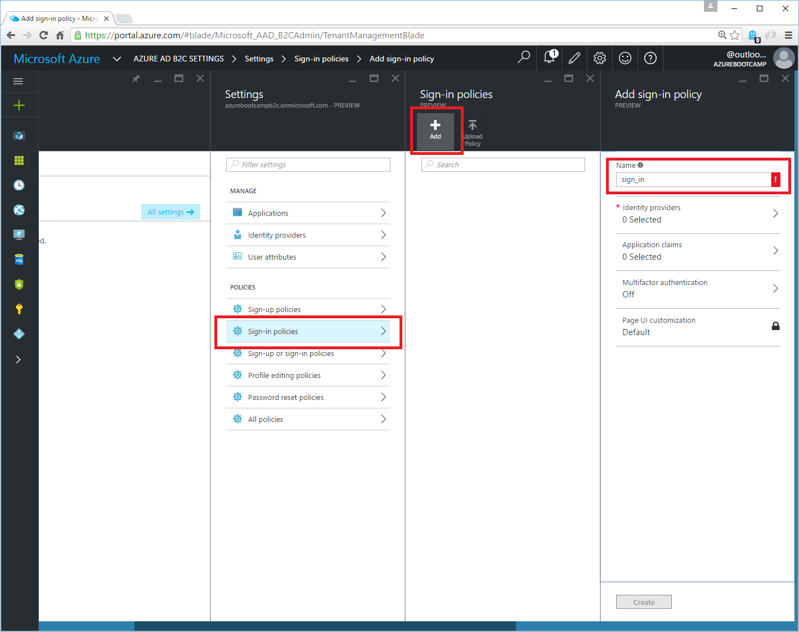

Under **Identity Providers** select **Local Account SignIn**

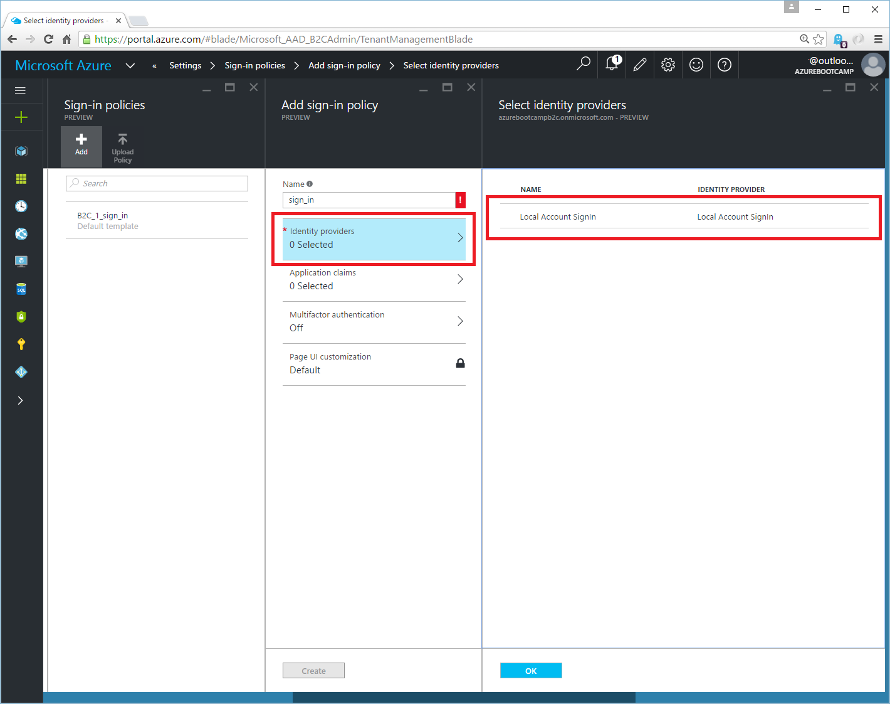

Select following Application claims:

+ DisplayName
+ Identity Provider
+ User's Object ID

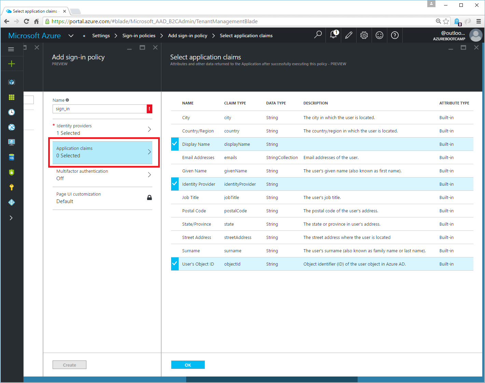

Press **Ok** and then **Create** to create the new policy.

# 4. Connect your application with Azure AD B2C

The following steps describe how to configure and integrate Azure B2C into our chat application.

Note: Azure will automatically prefix your sign-in policy name with **B2C_1_XXX**. For example **B2C_1_sign_in**.

## 4.1 Project **Trivadis.AzureBootcamp.WebApp** 

**Web.config**

```xml
  <appSettings>
    <add key="ida:RedirectUri" value="https://localhost:44335/" />
    <add key="ida:AadInstance" value="https://login.microsoftonline.com/{0}{1}{2}" />
    <add key="ida:SignInPolicyId" value="NAME OF YOUR SIGN IN POLICY" />
    <add key="ida:Tenant" value="DOMAINNAME.onmicrosoft.com" />
    <add key="ida:ClientId" value="Application Client ID (from Portal)" />
    <add key="ida:ClientSecret" value="App Key (from Portal)" />
  </appSettings>
```

**Trivadis.AzureBootcamp.WebApp.Startup.cs**

```csharp
public void Configuration(IAppBuilder app)
{
    // Configure MVC
    WebMvc.Configure();

    // Configure Azure B2C
    AzureB2C.Configure(app);
}
```


**Trivadis.AzureBootcamp.WebApp.Controllers.HomeController.cs**

Add the **SignInPolicy-Attribute** on top of the **LoginAzureB2C** Action.

```csharp
[HttpGet]
[SignInPolicy]
public ActionResult LoginAzureB2C()
{
    return RedirectToAction("Index");
}
```


## 4.2 Project **Trivadis.AzureBootcamp.WebApi** 

**Web.config**

```xml
  <appSettings>
    <add key="ida:AadInstance" value="https://login.microsoftonline.com/{0}/{1}/{2}?p={3}" />
    
    <add key="ida:PolicyId" value="NAME OF YOUR SIGN IN POLICY" />
    <add key="ida:Tenant" value="DOMAINNAME.onmicrosoft.com" />
    <add key="ida:ClientId" value="Application Client ID (from Portal)" />
  </appSettings>
```

**Trivadis.AzureBootcamp.WebApi.Startup.cs**

```csharp
public void Configuration(IAppBuilder app)
{
    // Configure SignalR
    SignalR.Configure(app);

    // Configure Azure B2C
    AzureB2C.Configure(app);

    // Configure WebApi
    Common.WebApi.Configure(app);
}
```

**Trivadis.AzureBootcamp.WebApi.Common.WebApi.cs**

```csharp
private static void ConfigureApi(HttpConfiguration config)
{
    config.Filters.Add(new ApiAuthenticationFilter());
    config.Filters.Add(new ApiAuthorizeAttribute());
}
```


# 5. Create a user for your application

Sign in to the [Azure classic portal](https://manage.windowsazure.com/). And click **Active Directory > Users > Add User**.

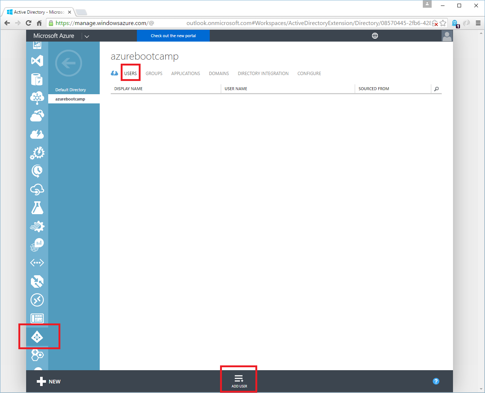

Set username, firstame, lastname and displayname and press **Next** to complete the wizard.

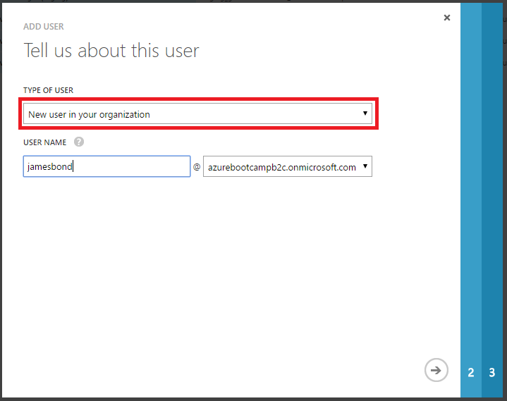

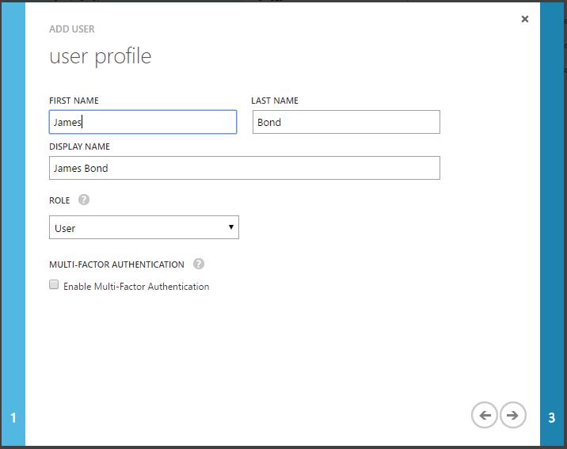

Finally, press **create** to setup the new user in your directory. We need username and password later in the lab, so copy username and the generated password.

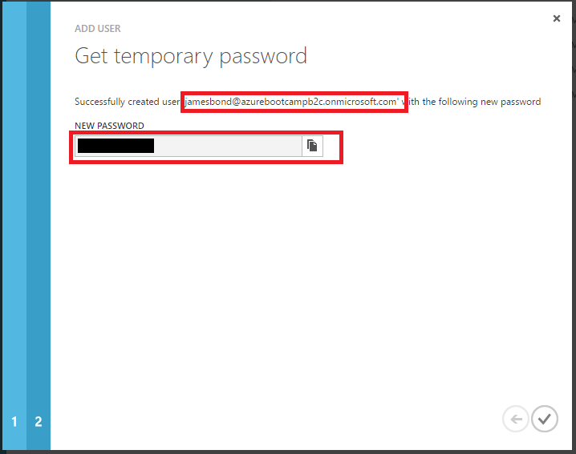


# 6. Login

Start your application by pressing F5 in Visual Studio. Click **LOGIN AZURE B2C**


Select **Local Account SignIn** and enter your user credentials created in the last chapter.

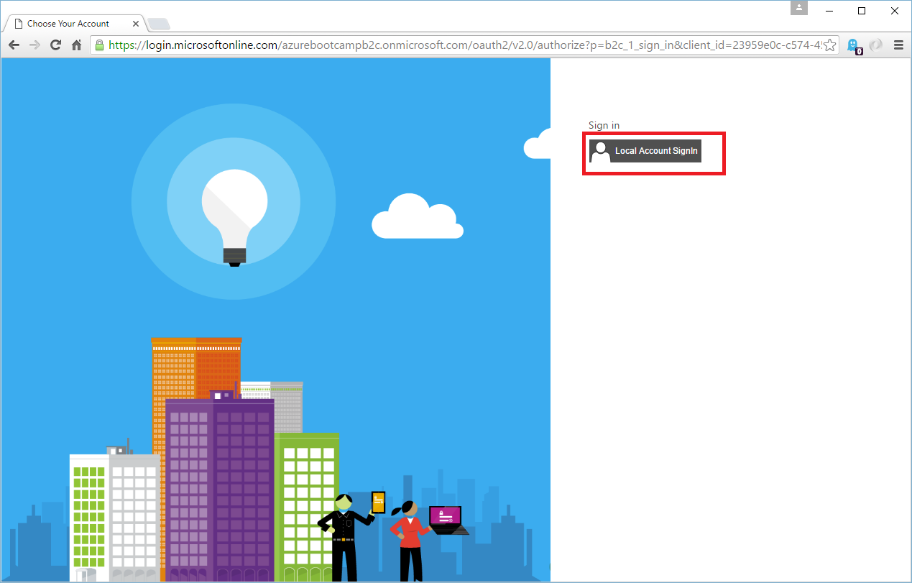
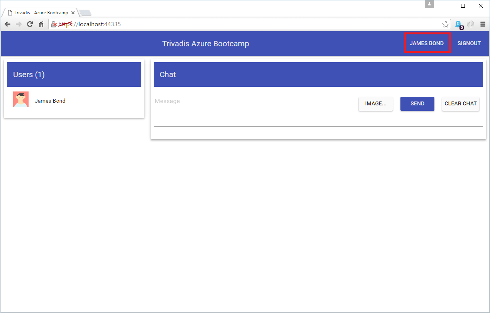


