# 1. [Sign-Up and Sign-In with Microsoft account](https://azure.microsoft.com/en-us/documentation/articles/active-directory-b2c-setup-msa-app/) 

When you use Azure Active Directory B2C, your consumers can 
sign up for your applications by using their existing social accounts (Facebook, Google, Amazon, LinkedIn) or 
by creating new credentials (email address and password, or username and password); we call the latter "local accounts."

To use Microsoft account as an identity provider in Azure Active Directory (Azure AD) B2C, you need to create a Microsoft account application and supply it with the right parameters. You need a Microsoft account to do this.

## 1.1 Register your Azure Bootcamp App in Microsoft Developer Center

Go to the [Microsoft Developer Center](https://account.live.com/developers/applications) and sign in with your Microsoft account credentials.
If you don’t have one, you can get it at [https://www.live.com/](https://www.live.com/).

Click **Add an app**, provide a name and click **Create application**. 

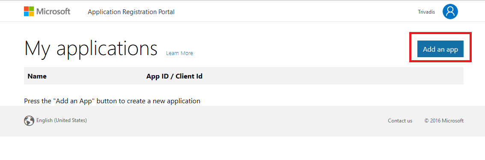

Generate Application Secrets by pressing **Generate New Password**. 

**Note** : the generated password is visible only once! As soon the popup appears, be sure you've copied the generated key.
Also copy the **Application Id** for further use.  

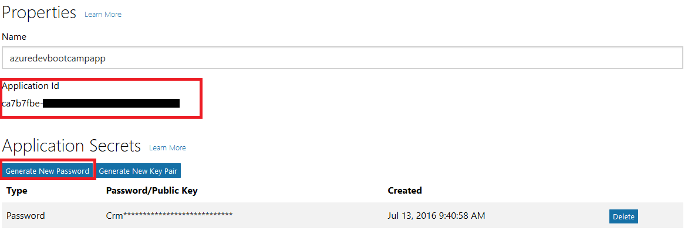

In the properties page, select **Add Platform** and choose **Web**

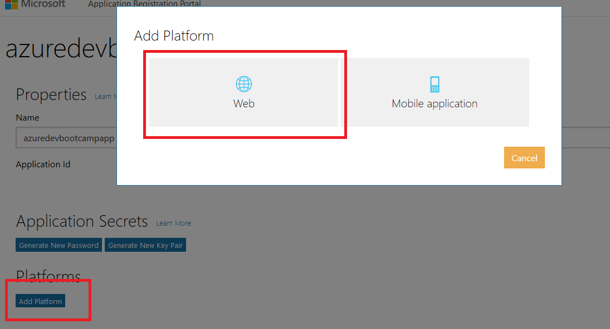

Enter **https://login.microsoftonline.com/te/{tenant}/oauth2/authresp** in the Redirect URLs field. 
Replace {tenant} with your tenant's name (for example, myazurebootcamp.onmicrosoft.com). 

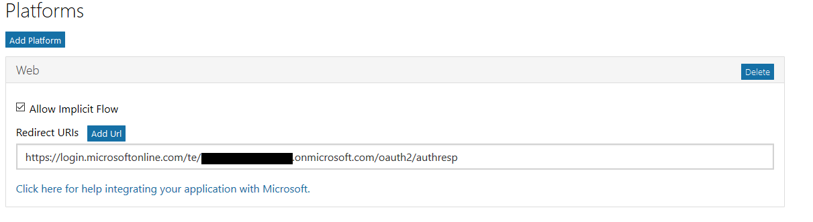

Click Save at the bottom of the page and return to your azure portal.

## 1.2 Configure Azure B2C Directory

In your Azure B2C settings, select **Identity Providers** and then **Add** a new one of type **Microsoft Account**.
Give it a name and set the **Application Id** and **Application Secret** from the developer portal.

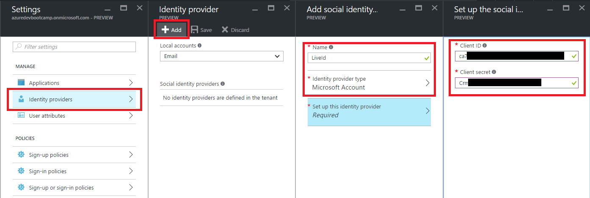

Open your **sign-in policy**  and press edit. Under **Identity Providers** be sure you have selected both **LiveId** and **Local Account SignIn**.

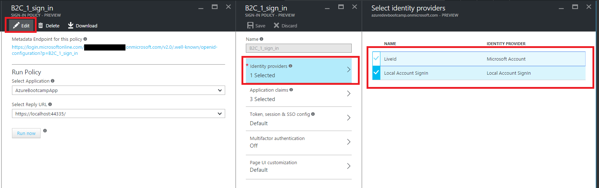

Press **OK** and then **Save**.  

Finally, we need an additional policy for sign up scenarios, so user can register their LiveId with you Azure B2C Directory.

In your Azure B2C settings, select **Sign-up policies** -> **Add**. Set a name (ex. sign_ip) 
and ensure under **Identity Providers** the Miccrosoft Account is selected.

Press **OK**.

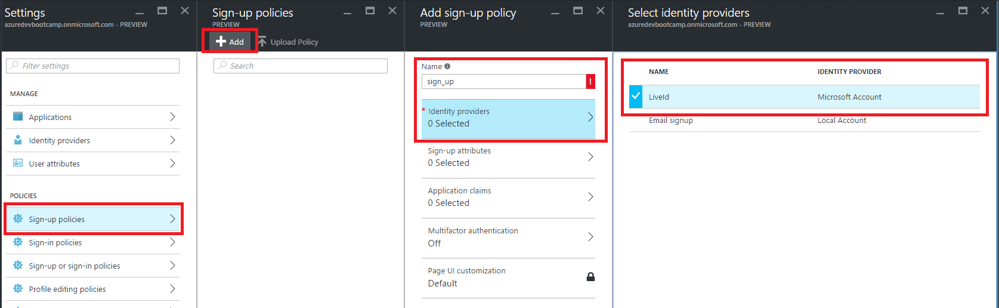

Under **Sign-up attributes** be sure DisplayName and Email Address is selected. 
These attributes has to be provided later by the user when he first signs up with his account.

Press **OK**.

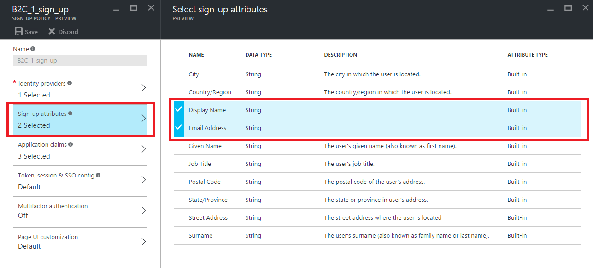

Unser **Application claims** selected **Display Name**, **Identity Provider** and **User's Object ID**

Press **OK** and **Save** to create the new sign up policy. 

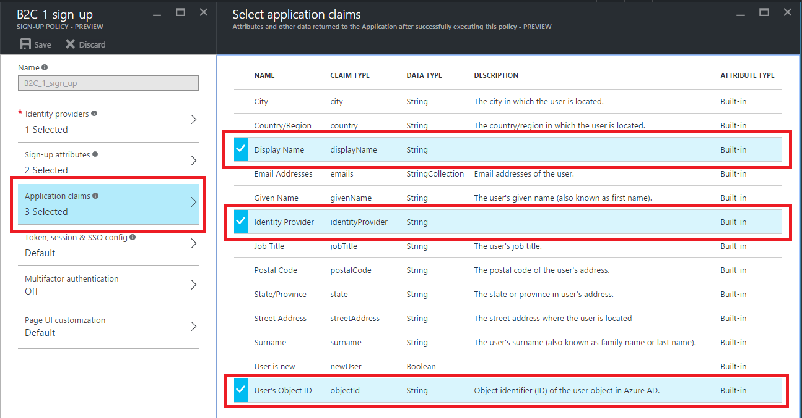

For the sake of simplicity, signing up from our App isn't supported. Instead of, you can trigger the sign up process for a LiveId-User manually by selecting
**Sign-up policies** -> **B2C_1_sign_up** -> **Run now**

**Note** : You can ignore **Select Reply URL**

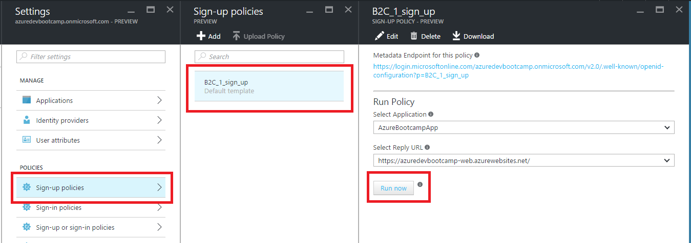

This action will redirects you to the Live Id login page. Login with a live id of your choice.

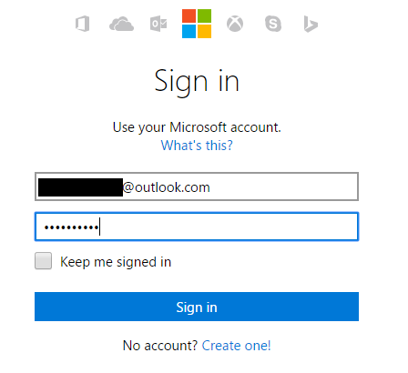

Press **Sign in** and accept the permissions requests by your application.

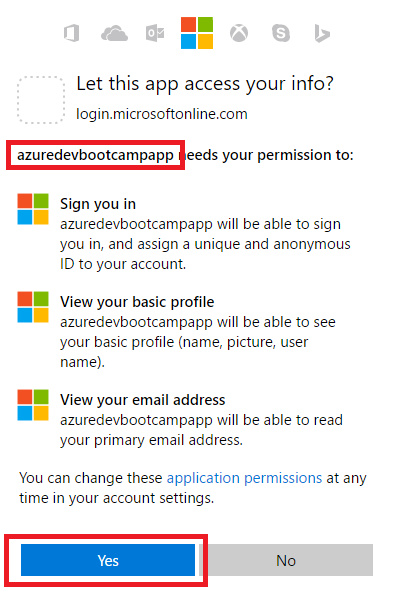

Provide an Email-Address and Display Name (= sign-up attributes configured by your sign up policy) and press **Continue**

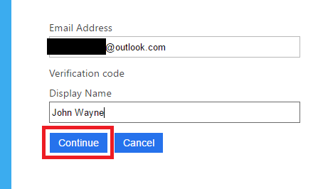

To check if your live id is really connected with your Azure B2C Directory, go to [https://manage.windowsazure.com/](https://manage.windowsazure.com/), 
and select your Directory. Under **Users**, your new sign up users should be visible.

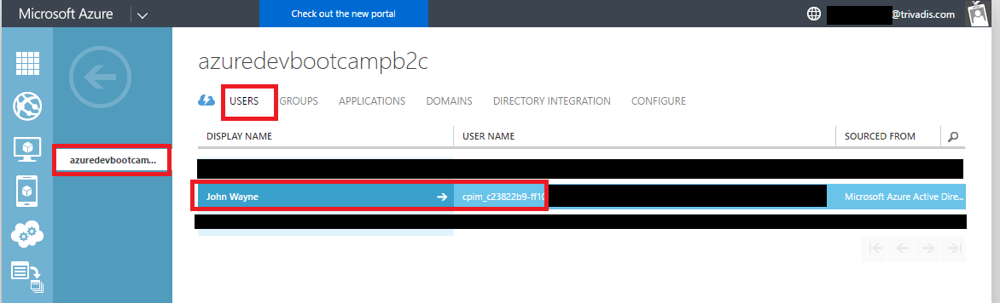

Your Application now supports sign-in with Microsoft Account and Local Account

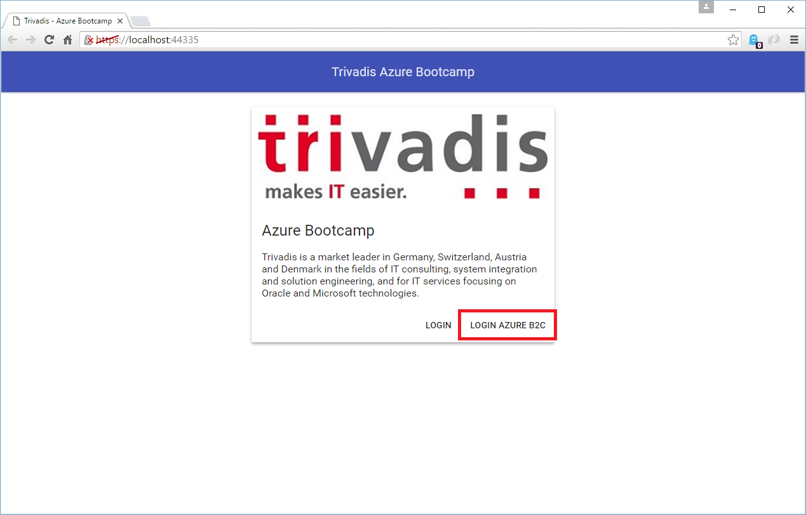

