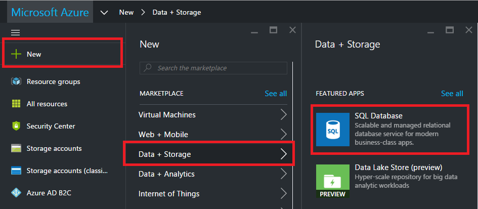
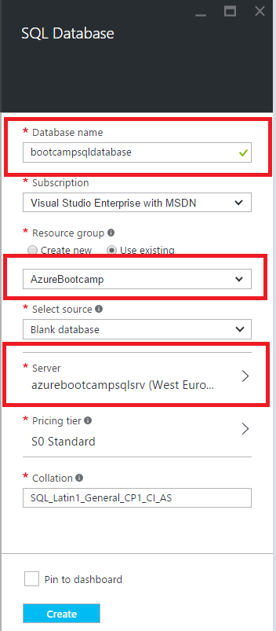
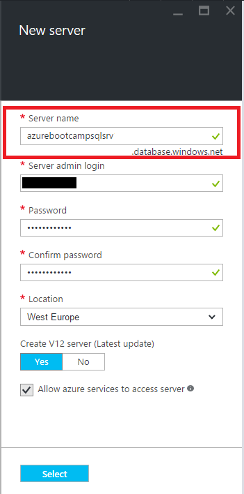

# 1. Create a [SQL Database](https://azure.microsoft.com/en-us/documentation/articles/sql-database-technical-overview/)

SQL Database is a relational database service in the cloud based on the market-leading Microsoft SQL Server engine, with mission-critical capabilities. SQL Database delivers predictable performance, scalability with no downtime, business continuity and data protection—all with near-zero administration. You can focus on rapid app development and accelerating your time to market, rather than managing virtual machines and infrastructure. Because it’s based on the SQL Server engine, SQL Database supports existing SQL Server tools, libraries and APIs, which makes it easier for you to move and extend to the cloud.

Sign in into [Azure Portal](https://portal.azure.com/).
To create Sql Database, select **New**, **Data + Storage** and **SQL Database**.

Fill out all necessary fields as shown below. 

**Note :** You probably need to create a new [SQL Database logical server](https://azure.microsoft.com/en-us/documentation/articles/sql-database-get-started/#create-an-azure-sql-database-logical-server) first, or you can select an existing one. 

Provide the values for the following server properties to create a new logical server:

1.  Server name
2.  Server admin login
3.  Password
4.  Location

Finally, press on **select** to use this logical server. 
On the Sql Database blade press **create** and in the notification area, you can see that deployment has started.