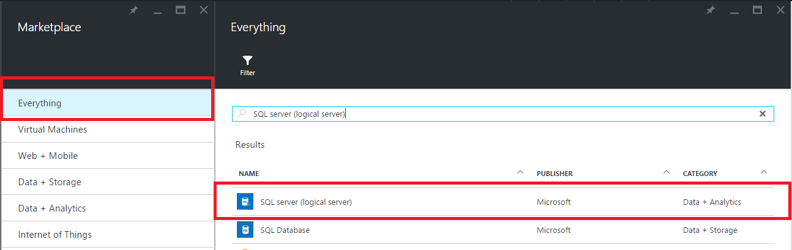
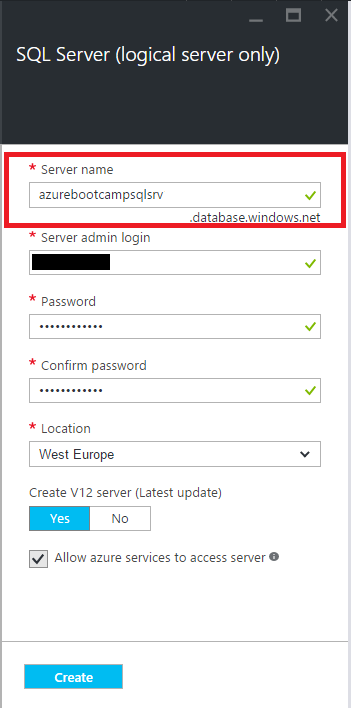
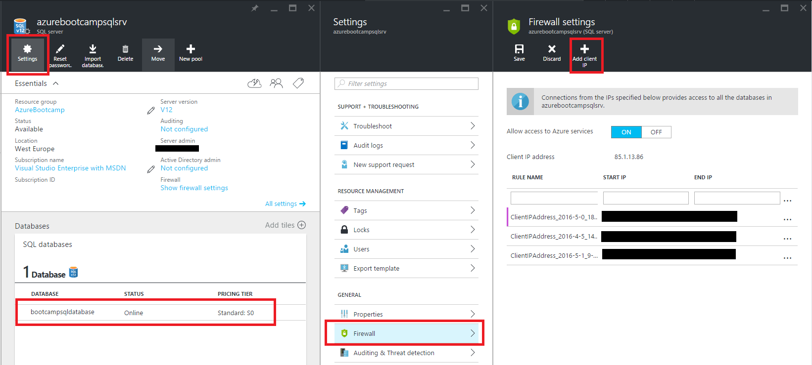
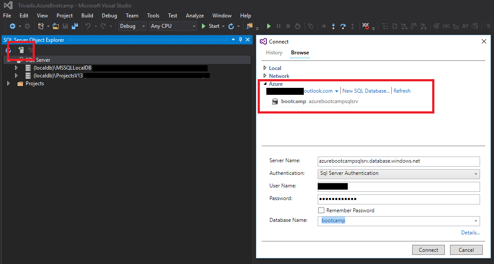
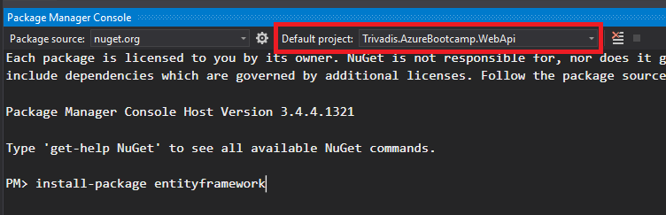
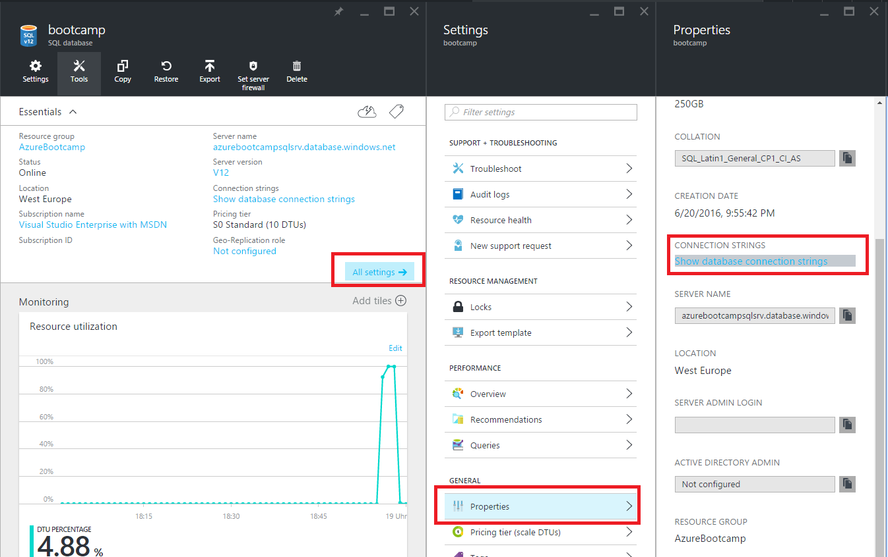

# 1. Create a [SQL Database](https://azure.microsoft.com/en-us/documentation/articles/sql-database-technical-overview/)

SQL Database is a relational database service in the cloud based on the market-leading Microsoft SQL Server engine, with mission-critical capabilities. SQL Database delivers predictable performance, scalability with no downtime, business continuity and data protection—all with near-zero administration. You can focus on rapid app development and accelerating your time to market, rather than managing virtual machines and infrastructure. Because it’s based on the SQL Server engine, SQL Database supports existing SQL Server tools, libraries and APIs, which makes it easier for you to move and extend to the cloud.

Sign in into [Azure Portal](https://portal.azure.com/).

Before we can create a new Sql Database we need a SQL Database logical server first.
select **New**, search in the marketplace for **SQL Server**, select **SQL server (logical server)** and press create.



Provide the values for the following server properties to create a new logical server:

1.  Server name
2.  Server admin login
3.  Password
4.  Location



Press **create**.

Now , let's create a Sql Database, by selecting **New**, **Data + Storage** and **SQL Database**.


Fill out all necessary fields as shown below and use the server created before. 


On the Sql Database blade press **create** and in the notification area, you can see that deployment has started.

# 2. Check connectivity

Azure SQL server uses firewall rules to allow connections to your servers and databases. You can define server-level and database-level firewall settings for the master or a user database in your Azure SQL server logical server to selectively allow access to the database.

To configure your firewall, you create firewall rules that specify ranges of acceptable IP addresses. You can create firewall rules at the server and database levels.

Go to your server and select **Settings** -> **Firewall**, select **Add client IP** and press **Save**   


To verify your connection, in Visual Studio go to **View** -> **SQL Server Object Explorer** -> **Add Sql Server** search for your Azure servers and connect your SQL Database using your credentials





# 3. Integrate SQL Database

Open the Package Manager Console by selecting View -> Other Windows -> Package Manager Console. Ensure **Trivadis.AzureBootcamp.WebApi** is selected



Now install the [Entity Framework](https://msdn.microsoft.com/en-us/en$/data/ef.aspx) by executing following command in the Package Manager Console:

```
PM> install-package entityframework 
```

## 3.1 Set connection string in  Trivadis.AzureBootcamp.WebApi.web.config

From the portal, you easily can retrieve the connectionstring for your database under **All ssettings** -> **Properties** -> **CONNECTION STRINGS** under **ADO.NET (Sql Authentication**)



Copy the connectionstring and insert it in the **web.config** of your api project. 

```xml
  <connectionStrings>
    <add name="ChatDbContext"
         connectionString="Server=tcp:{yourserver}.database.windows.net,1433;Data Source={yourserver.database.windows.net;Initial Catalog={your database};Persist Security Info=False;User ID={your_username};Password={your_password};MultipleActiveResultSets=False;Encrypt=True;TrustServerCertificate=False;Connection Timeout=30;"
         providerName="System.Data.SqlClient" />
  </connectionStrings>
```

## 3.2 Project **Trivadis.AzureBootcamp.WebApi** 

Create a new DbContext class under **Trivadis.AzureBootcamp.WebApi.Models**

```csharp
using System;
using System.ComponentModel.DataAnnotations;
using System.Data.Entity;
using System.Data.Entity.ModelConfiguration.Conventions;

namespace Trivadis.AzureBootcamp.WebApi.Models
{
    public class ChatDbContext : DbContext
    {
        public ChatDbContext() : base("name=ChatDbContext")
        {
            Database.SetInitializer(new DropCreateDatabaseIfModelChanges<ChatDbContext>());
        }

        public DbSet<ChatMessage> ChatMessages { get; set; }
        protected override void OnModelCreating(DbModelBuilder modelBuilder)
        {
            modelBuilder.Conventions.Remove<PluralizingTableNameConvention>();
            base.OnModelCreating(modelBuilder);
        }
    }

    public class ChatMessage
    {
        [Key]
        public int Id { get; set; }
        [Required]
        public String SenderUserId { get; set; }
        [Required]
        public String SenderUserName { get; set; }
        public String Message { get; set; }
        public String ImageUrl { get; set; }
        [Required]
        public DateTimeOffset Created { get; set; }

        public static ChatMessage FromDto(ChatMessageDTO dto)
        {
            if (dto == null)
                throw new ArgumentNullException(nameof(dto));

            ChatMessage entity = new ChatMessage();
            entity.ImageUrl = dto.ImageUrl;
            entity.Message = dto.Message;
            entity.SenderUserId = dto.SenderUserId;
            entity.SenderUserName = dto.SenderUserName;
            entity.Created = DateTimeOffset.Now;
            return entity;
        }
    }
}
```

Add the following snippet to **Trivadis.AzureBootcamp.WebApi.Controllers.AdminController.cs**

```csharp
[HttpGet]
[Route("chatmessages")]
public IHttpActionResult ChatMessages()
{
    return Ok(new ChatDbContext().ChatMessages.ToList());
}
```

Add the following snippet to **Trivadis.AzureBootcamp.WebApi.Controllers.ChatController.cs** at the end of the **SendMessage** Methode

```csharp
using (ChatDbContext db = new ChatDbContext())
{
    ChatMessage entity = ChatMessage.FromDto(message);
    db.ChatMessages.Add(entity);
    db.SaveChanges();
}

return Ok();

```

